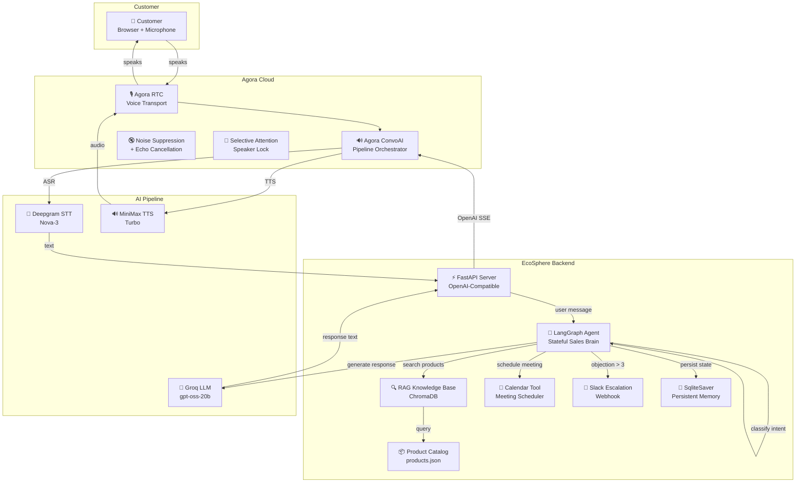
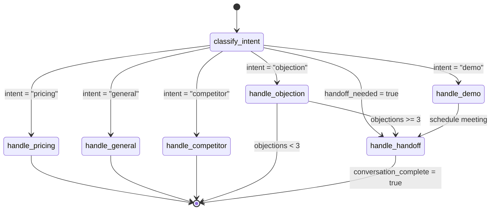
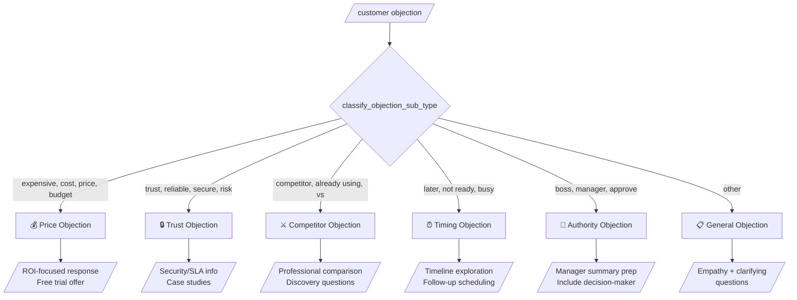
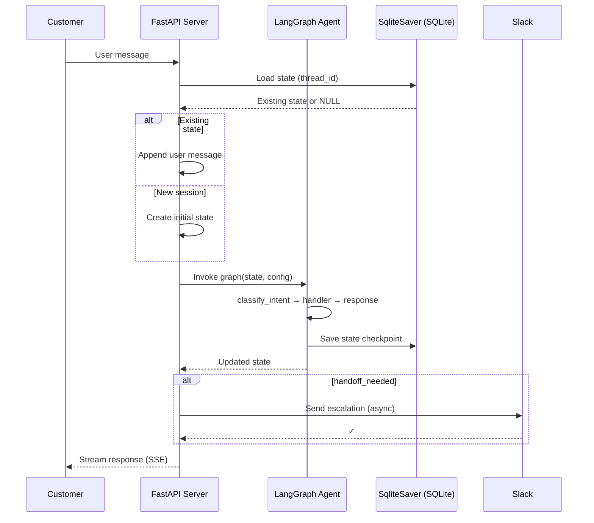
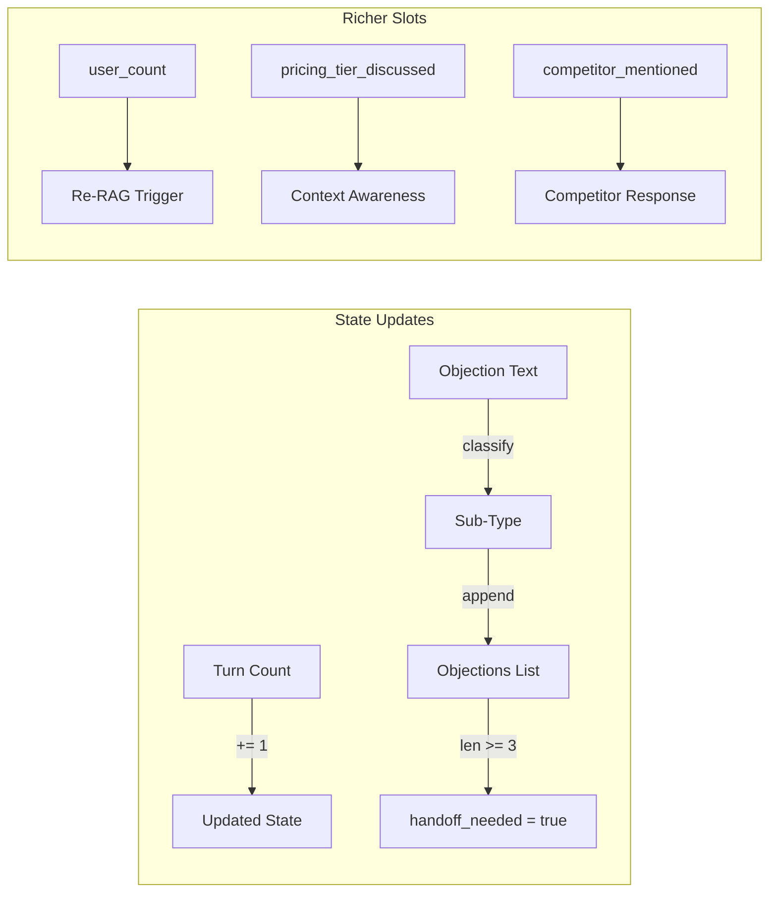

# 🏗️ EcoSphere Architecture Diagrams

## System Overview

```mermaid
graph TB
    subgraph "Customer"
        C[👤 Customer<br/>Browser + Microphone]
    end

    subgraph "Agora Cloud"
        A1[🎙️ Agora RTC<br/>Voice Transport]
        A2[🔊 Agora ConvoAI<br/>Pipeline Orchestrator]
        A3[🔇 Noise Suppression<br/>+ Echo Cancellation]
        A4[🎯 Selective Attention<br/>Speaker Lock]
    end

    subgraph "EcoSphere Backend"
        S1[⚡ FastAPI Server<br/>OpenAI-Compatible]
        S2[🧠 LangGraph Agent<br/>Stateful Sales Brain]
        S3[🔍 RAG Knowledge Base<br/>ChromaDB]
        S4[📦 Product Catalog<br/>products.json]
        S5[📅 Calendar Tool<br/>Meeting Scheduler]
        S6[🔔 Slack Escalation<br/>Webhook]
        S7[💾 SqliteSaver<br/>Persistent Memory]
    end

    subgraph "AI Pipeline"
        LLM[🤖 Groq LLM<br/>gpt-oss-20b]
        STT[📝 Deepgram STT<br/>Nova-3]
        TTS[🔊 MiniMax TTS<br/>Turbo]
    end

    C -->|speaks| A1
    A1 --> A2
    A2 -->|ASR| STT
    STT -->|text| S1
    S1 -->|user message| S2
    S2 -->|classify intent| S2
    S2 -->|search products| S3
    S3 -->|query| S4
    S2 -->|schedule meeting| S5
    S2 -->|objection > 3| S6
    S2 -->|persist state| S7
    S2 -->|generate response| LLM
    LLM -->|response text| S1
    S1 -->|OpenAI SSE| A2
    A2 -->|TTS| TTS
    TTS -->|audio| A1
    A1 -->|speaks| C
```

## LangGraph Agent Flow

```mermaid
stateDiagram-v2
    [*] --> classify_intent

    classify_intent --> handle_pricing: intent = "pricing"
    classify_intent --> handle_objection: intent = "objection"
    classify_intent --> handle_demo: intent = "demo"
    classify_intent --> handle_competitor: intent = "competitor"
    classify_intent --> handle_general: intent = "general"
    classify_intent --> handle_handoff: handoff_needed = true

    handle_pricing --> [*]
    handle_general --> [*]
    handle_competitor --> [*]

    handle_objection --> [*]: objections < 3
    handle_objection --> handle_handoff: objections >= 3

    handle_demo --> handle_handoff: schedule meeting
    handle_handoff --> [*]: conversation_complete = true
```

## Objection Sub-Classification

```mermaid
graph TD
    OBJ[/customer objection/] --> CLASSIFY{classify_objection_sub_type}

    CLASSIFY -->|expensive, cost, price, budget| PRICE[💰 Price Objection]
    CLASSIFY -->|trust, reliable, secure, risk| TRUST[🔒 Trust Objection]
    CLASSIFY -->|competitor, already using, vs| COMP[⚔️ Competitor Objection]
    CLASSIFY -->|later, not ready, busy| TIMING[⏰ Timing Objection]
    CLASSIFY -->|boss, manager, approve| AUTH[👔 Authority Objection]
    CLASSIFY -->|other| GENERAL[📋 General Objection]

    PRICE --> PROMPT1[/"ROI-focused response<br/>Free trial offer"/]
    TRUST --> PROMPT2[/"Security/SLA info<br/>Case studies"/]
    COMP --> PROMPT3[/"Professional comparison<br/>Discovery questions"/]
    TIMING --> PROMPT4[/"Timeline exploration<br/>Follow-up scheduling"/]
    AUTH --> PROMPT5[/"Manager summary prep<br/>Include decision-maker"/]
    GENERAL --> PROMPT6[/"Empathy + clarifying<br/>questions"/]
```

## Session Persistence Flow

```mermaid
sequenceDiagram
    participant C as Customer
    participant S as FastAPI Server
    participant G as LangGraph Agent
    participant DB as SqliteSaver (SQLite)
    participant SL as Slack

    C->>S: User message
    S->>DB: Load state (thread_id)
    DB-->>S: Existing state or NULL

    alt Existing state
        S->>S: Append user message
    else New session
        S->>S: Create initial state
    end

    S->>G: Invoke graph(state, config)
    G->>G: classify_intent → handler → response
    G->>DB: Save state checkpoint
    G-->>S: Updated state

    alt handoff_needed
        S->>SL: Send escalation (async)
        SL-->>S: ✓
    end

    S-->>C: Stream response (SSE)
```

## Data Flow for Objection Handling

```mermaid
graph LR
    subgraph "State Updates"
        S1[Turn Count] --> |+= 1| S2[Updated State]
        S3[Objection Text] --> |classify| S4[Sub-Type]
        S4 --> |append| S5[Objections List]
        S5 --> |len >= 3| S6[handoff_needed = true]
    end

    subgraph "Richer Slots"
        U1[user_count] --> U2[Re-RAG Trigger]
        U3[pricing_tier_discussed] --> U4[Context Awareness]
        U5[competitor_mentioned] --> U6[Competitor Response]
    end
```
